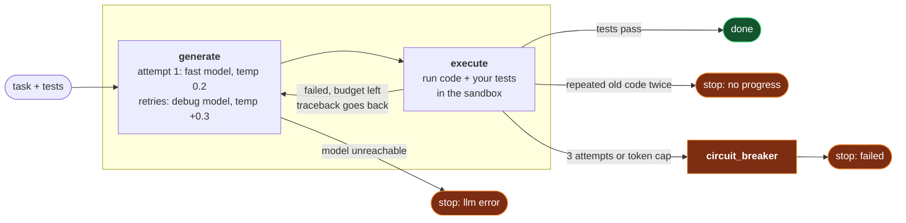

# Self-correcting code agent

[](https://github.com/Madhuhas/self-correcting-code-agent/actions/workflows/tests.yml)


[](LICENSE)

A small model writes Python. The code runs in a sandbox. If it crashes, the traceback goes back to the model and it tries again. After three attempts it stops, whatever happens.

<p align="center">
  
</p>

Everything runs on my laptop: an i7-7500U with 12 GB of RAM and no GPU. The models are Qwen2.5-Coder 1.5B and 3B, loaded directly into the Python process with llama.cpp. There's no server to install and no API key.

## Quick start

```bash
pip install -r requirements.txt

python -m agent --demo      # scripted model, real sandbox: see the loop in 2 seconds
python -m pytest -q         # 50 tests, no model needed
```

To use real models:

```bash
# llama.cpp, prebuilt for CPU, so no compiler is needed
pip install llama-cpp-python --only-binary=llama-cpp-python \
    --extra-index-url https://abetlen.github.io/llama-cpp-python/whl/cpu

python -m agent.download    # ~3 GB of GGUF models into ./models

python -m agent "Write fizzbuzz(n) returning 'Fizz', 'Buzz', 'FizzBuzz' or str(n)" \
    --tests examples/fizzbuzz_tests.py
```

The exit code is 0 when the tests pass and 1 when they don't, so you can script it.

## How it works

The loop is a LangGraph state machine with three nodes. Every arrow below is a small Python function that you can unit-test on its own.



1. **generate** asks the model for a script. The first attempt goes to the 1.5B model, because most tasks are easy and it's the faster of the two (in my runs, ~40 s per call against 90–160 s for the 3B). Each retry goes to the 3B model at a higher temperature.
2. **execute** adds your test file to the end of the script and runs it in a fresh interpreter. Your tests are added after generation, so the model can't make a failure go away by editing them.
3. On failure, the next prompt holds the task, the failing code, the full traceback, and one line for each earlier failure. Just the latest attempt goes in full, which keeps prompts short. On a CPU, every extra prompt token adds to the wait.

Every attempt is saved to an audit log with the model, temperature, code, output, error, tokens and timings. `--json trace.json` writes it out.

## What stops it from running away

| Guard | Trigger | Default |
|---|---|---|
| Attempt limit | attempts ≥ `max_attempts` | 3 |
| Token budget | prompt + completion tokens across all attempts | 20,000 |
| No-progress check | the model resubmits code it already tried, twice in a row | on |
| LangGraph recursion limit | a backstop in case the routing logic itself has a bug | `2 × attempts + 5` steps |
| Execution timeout | the code's own run time (interpreter startup isn't counted) | 10 s |
| Output cap | stdout + stderr size | 10 MB |

## The sandbox

Model-written code is untrusted, even when the model means well. It might delete the wrong folder, spin forever, or allocate 20 GB. Each run gets a fresh temporary folder and a fresh interpreter, with several layers of protection:

| Layer | Windows | Linux / macOS | Docker mode |
|---|---|---|---|
| Separate process, env vars stripped (no API keys) | ✓ | ✓ | ✓ |
| Wall-clock timeout, output cap | ✓ | ✓ | ✓ |
| Memory cap | Job Object | `RLIMIT_AS` (Linux) | `--memory` |
| Can't start child processes | Job Object | `RLIMIT_NPROC` + guard | `--pids-limit` |
| Network blocked | guard | guard | `--network none` |
| Writes only inside its own folder | guard | guard | `--read-only` root |
| `ctypes` blocked | guard | guard | guard |

The **guard** is a [PEP 578 audit hook](https://peps.python.org/pep-0578/). It's installed in the child before the model's code runs, and it can't be removed afterwards. A blocked action raises an ordinary exception:

```
PermissionError: sandbox policy: network access is not allowed
```

So a blocked call becomes a normal error that goes back to the model like any other traceback. The memory and process limits come from the kernel (Job Object, rlimits), so those still hold even if code gets past the guard.

For code you really don't trust, use `--sandbox docker`. The same bootstrap then runs inside a `python:3.11-slim` container with no network, a read-only filesystem, no Linux capabilities, and memory and process limits. It needs a Docker engine running Linux containers (on Windows, that's Docker Desktop's default mode). The CI pipeline runs this path on every push.

## Results on a CPU laptop

Default settings, i7-7500U, 12 GB RAM, no GPU.

| Task | Result | Attempts | Tokens | Notes |
|---|---|---|---|---|
| FizzBuzz | pass | 1 | 289 | ~50 s on the 1.5B model |
| Strict Roman-numeral parser | fail (circuit breaker) | 3 | 3,292 | attempt 2 repeated attempt 1, so it wasn't re-run; attempt 3 tried a new approach but still rejected lowercase |

The Roman-numeral task is there because it's hard for models this small. It has to handle lowercase input and reject `IIII`, `IC` and `VV`. Watching the model fail at it is what exposed the bugs below.

## Bugs that only showed up with real models

The mocked test suite passed from day one. Running real models found four problems it couldn't:

**Repeated fixes.** At temperature 0.2, the 3B model returned exactly the same broken code twice in a row. The no-progress check stopped the loop, which is what it's for, but the retries were wasted. Now each retry raises the temperature by 0.3, and the model has to name the faulty line before writing a fix.

**False timeouts.** With 3 GB of models in RAM, starting a new Python process sometimes took 6 to 17 seconds instead of 0.2. The timer counted that, so correct code was reported as a `TimeoutError`, and the model spent an attempt "fixing" code that wasn't broken. Now the child signals when it's ready, and only then does the timer start.

**Fix one bug, cause another.** When the model fixed the lowercase check, it broke uppercase input. The retry prompt now lists every earlier error in one line each, marked "do not bring these back".

**Giving up too early.** After the temperature change, the no-progress check still stopped the run the first time the model repeated itself. But a repeat at temperature 0.5 doesn't mean the next try at 0.8 will repeat too. Now a repeated script isn't run again, because its result is already known. The next prompt tells the model it repeated itself, and the loop stops only after two repeats in a row.

## Configuration

Environment variables, or the CLI flags where shown:

| Setting | Flag | Default | |
|---|---|---|---|
| `AGENT_BACKEND` | `--backend` | `llamacpp` | or `ollama` |
| `AGENT_FAST_MODEL` | `--fast-model` | Qwen2.5-Coder 1.5B Q4 | GGUF path, or an Ollama tag |
| `AGENT_DEBUG_MODEL` | `--debug-model` | Qwen2.5-Coder 3B Q4 | used for retries |
| `AGENT_MAX_ATTEMPTS` | `--max-attempts` | 3 | |
| `AGENT_MAX_TOKENS` | | 20000 | budget across all attempts |
| `AGENT_SANDBOX` | `--sandbox` | `process` | or `docker` |
| `AGENT_ALLOW_PACKAGES` | `--allow-packages` | off | lets generated code import installed packages (numpy, etc.) |
| `AGENT_ALLOW_NETWORK` | | off | |
| `AGENT_EXEC_TIMEOUT` | | 10 | seconds |
| `AGENT_MAX_MEMORY_MB` | | 512 | |

If you already run Ollama: `--backend ollama`, then `ollama pull qwen2.5-coder:1.5b` and `ollama pull qwen2.5-coder:3b`.

## Layout

```
agent/
  graph.py      the state machine: nodes, routing, circuit breaker
  sandbox.py    process and Docker sandboxes, audit-hook guard, Job Object / rlimits
  llm.py        LLMClient protocol + llama.cpp, Ollama and scripted clients
  prompts.py    system and retry prompts, code extraction
  config.py     settings, read from env vars
  download.py   fetches the GGUF models
  __main__.py   CLI
tests/          50 tests; none need a model
examples/       test files for the sample tasks
docs/loop.svg   the animation above
```

The graph talks to models only through a one-method `LLMClient` protocol. That's how the test suite runs a scripted fake model, and it's why adding another backend is about 40 lines.

## Limitations

- In `process` mode the guard runs inside the same interpreter as the code it's watching. It stops the mistakes models actually make, but a determined attacker could get around it. The kernel limits still hold, but for hostile code, use `--sandbox docker`.
- On Windows, the guard is the only thing blocking network access in process mode. Docker mode blocks it at the OS level.
- Small models run out of skill before they run out of attempts. On tasks like the Roman-numeral parser, 3 attempts with a 3B model often isn't enough. The circuit breaker makes that failure cheap, but it doesn't make it succeed. Pointing `--debug-model` at a bigger GGUF is a one-flag change.
